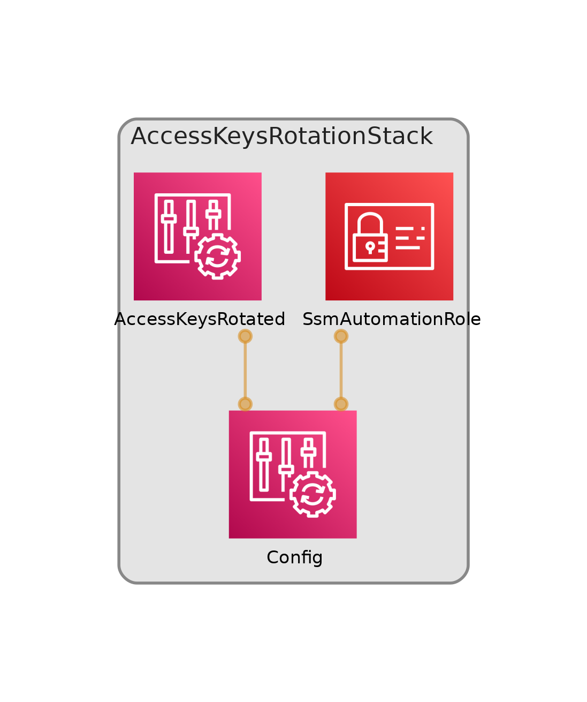

# AWS CDK AccessKeysRotationStack

A serverless AWS CDK stack that enforces IAM access key rotation using an AWS Config Rule and automates credential revocation via AWS Systems Manager (SSM) Automation.

[](https://www.python.org)
[](https://aws.amazon.com/cdk/)
[](https://github.com/username/repo)

## Overview

This AWS CDK stack sets up an AWS Config Rule to monitor and enforce the rotation of IAM access keys, ensuring they are rotated within a specified timeframe (default: 60 days). It also configures an SSM Automation document to revoke unused IAM user credentials, triggered by Config Rule violations. The solution enhances security by automating key management and revocation processes.



## Table of Contents
- [Features](#features)
- [Prerequisites](#prerequisites)
- [Architecture](#architecture)
- [Deployment](#deployment)
- [Cleanup](#cleanup)
- [Additional Resources](#additional-resources)


## Features
- **Access Key Rotation**: Enforces rotation of IAM access keys using an AWS Config managed rule.
- **Automated Revocation**: Uses SSM Automation to revoke unused credentials based on Config Rule violations.
- **Customizable Rules**: Allows modification of the rotation interval (e.g., `maxAccessKeyAge`) and SSM permissions.
- **CDK-Based**: Infrastructure defined and deployed using AWS Cloud Development Kit (CDK).
- **Security Focused**: Improves account security by monitoring and managing IAM credentials.

## Prerequisites
- **AWS CLI**: Installed and configured with appropriate credentials.
- **Node.js**: Required for AWS CDK (version 14 or higher recommended).
- **AWS Account**: With permissions to create Config Rules, SSM Automation documents, and IAM roles.

## Architecture

### Config Rule
- Creates an AWS Config managed rule to check if IAM access keys have been rotated within a specified timeframe.
- Default rotation period is 60 days; modify `maxAccessKeyAge` in the `AccessKeysRotationStack` constructor to adjust this interval.

### SSM Automation
- Sets up an SSM Automation document to revoke IAM user credentials unused for a specified period.
- Triggered by AWS Config Rule violations.
- **IAM Role**: Creates `SsmAutomationRole` for the `ssm.amazonaws.com` service principal, with an inline policy granting IAM actions and `config:ListDiscoveredResources` permissions. Customize `ssmAutomationPolicy` in the constructor for specific permissions.
- **Remediation Configuration**: Defined by `MyCfnRemediationConfiguration`, linking the Config Rule (`managedRule.configRuleName`) and SSM document as the target type. The `parameters` object includes IAM user ARN and maximum credential age.

## Deployment
1. Clone the repository and navigate to the project directory:
   ```bash
   git clone https://github.com/username/repo.git
   cd aws-cdk-access-keys-rotation-stack
   ```
2. Install dependencies:
   ```bash
   npm install
   ```
3. Deploy the stack:
   ```bash
   cdk deploy
   ```
4. Test access key revocation (optional):
   ```bash
   aws iam update-access-key --access-key-id <Access key ID> --status Inactive --user-name <IAM user name>
   ```
   - Replace `<Access key ID>` and `<IAM user name>` with valid values.

## Cleanup
To remove the stack and its resources from your AWS account:
```bash
cdk destroy
```

## Additional Resources
- [AWS CDK Documentation](https://docs.aws.amazon.com/cdk/latest/guide/home.html)
- [AWS Config Documentation](https://docs.aws.amazon.com/config/latest/developerguide/WhatIsConfig.html)
- [AWS Systems Manager (SSM) Automation Documentation](https://docs.aws.amazon.com/systems-manager/latest/userguide/automation.html)